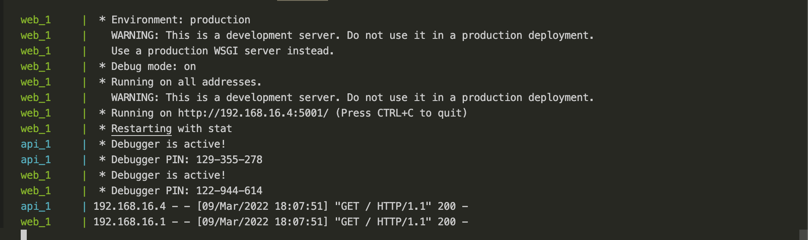
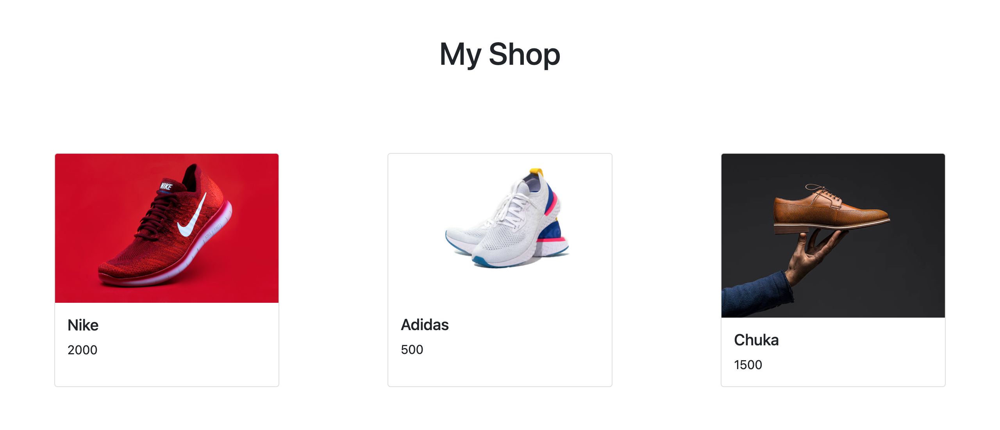
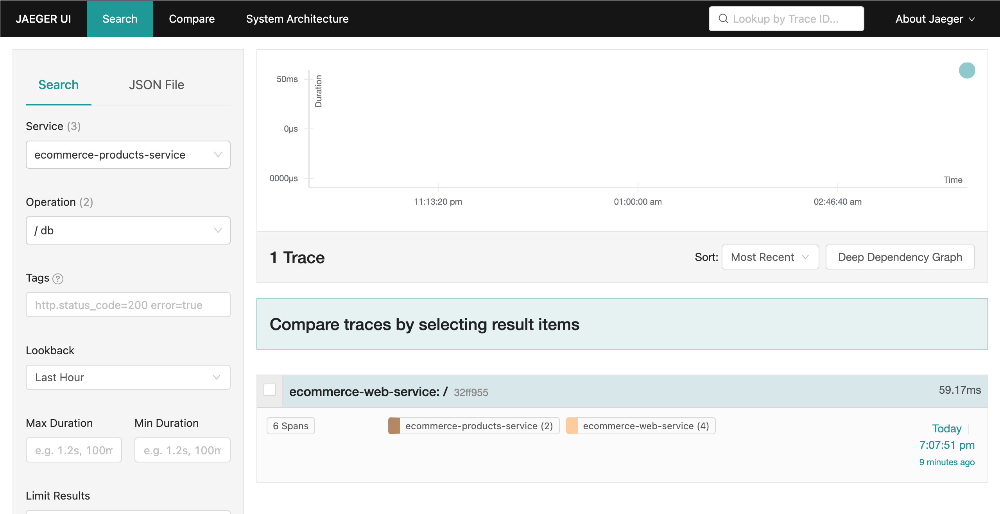

# Tracing with Open Telemetry and Jaeger

## Prerequisites

To follow up with this guide, make sure you have the following installed

- [Docker](https://docs.docker.com/get-docker/)

- [Docker Compose](https://docs.docker.com/compose/install/)

## How to run

- Clone the repo by running `git clone <repo_url>`

- A `Makefile` has been provided to make starting up the services easier so just run `make up` to create the dummy data in the database and start up docker compose

- You should see command line output similar to the image below

- Navigate to `http://localhost5000` on your browser to view the website

- Now head over to the Jaeger UI by navigating to `http://localhost:16686/search` to view traces for the application

- Finally, kill the running processes with `ctrl+c` and run `make down` to remove the containers created.

# Hire me

Looking for a DevOps engineer or SRE to join your team? Reach out to me via email [utibeabasiumanah6@gmail.com](mailto:utibeabasiumanah6@gmail.com)